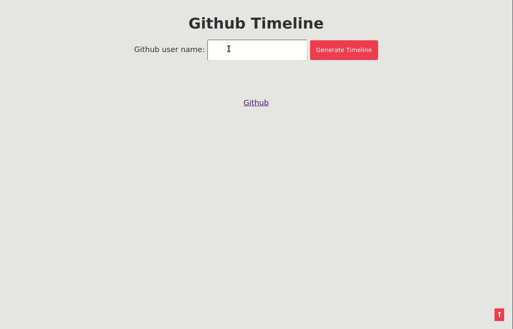

# cl-github-timeline
A Github timeline created in Common Lisp using [ningle](https://github.com/fukamachi/ningle)



## Usage

You need [roswell](https://github.com/snmsts/roswell) to install [clack](https://github.com/fukamachi/clack)
```
ros install clack
```

And then using clackup

```
clackup app.lisp
```

Go to `http://localhost:5000` in your browser to see the app in action.

## Install
```
git clone https://github.com/rajasegar/cl-github-timeline
cd cl-github-timeline
clackup app.lisp
```
